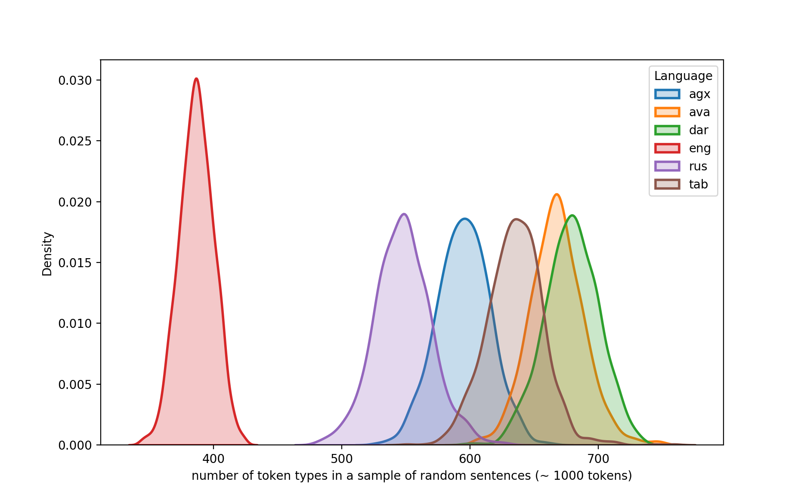
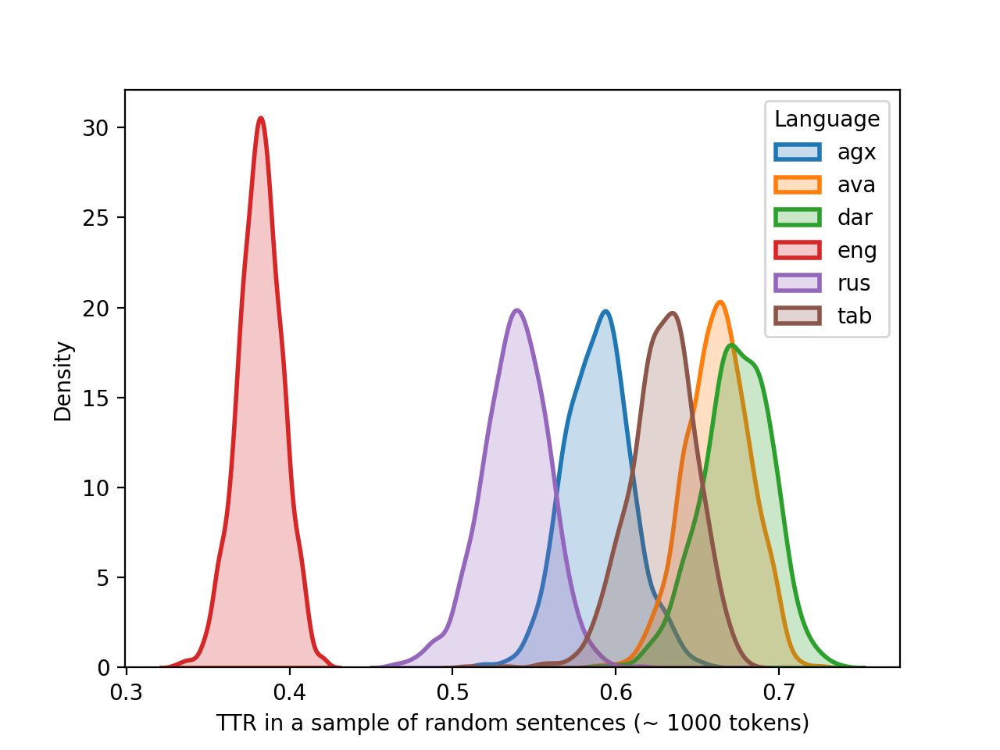
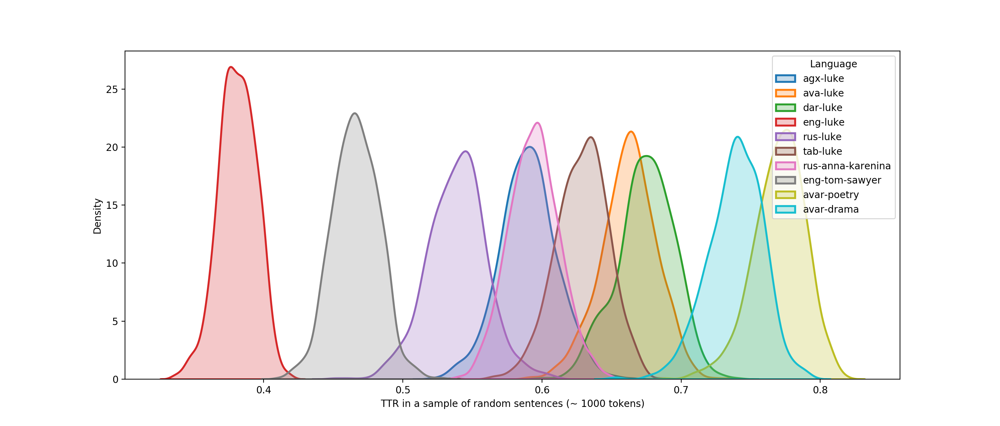
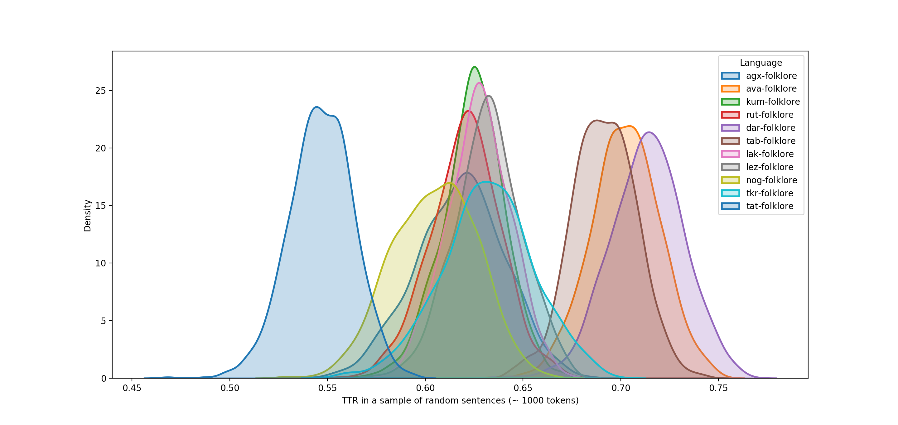
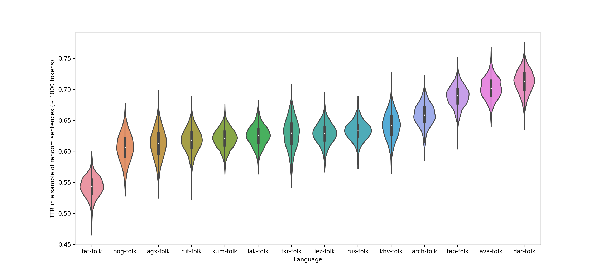
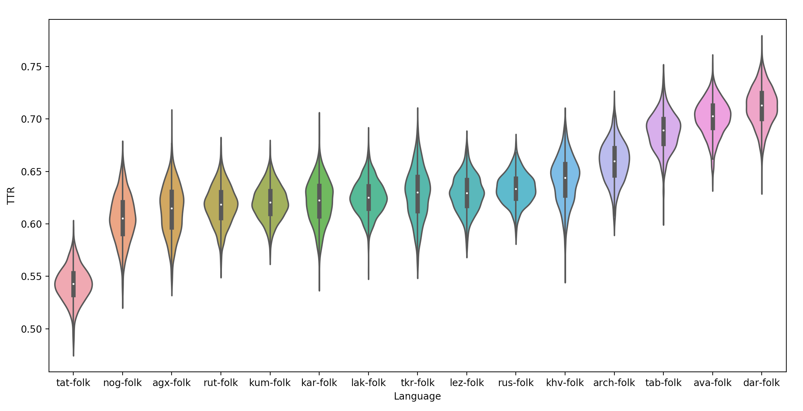
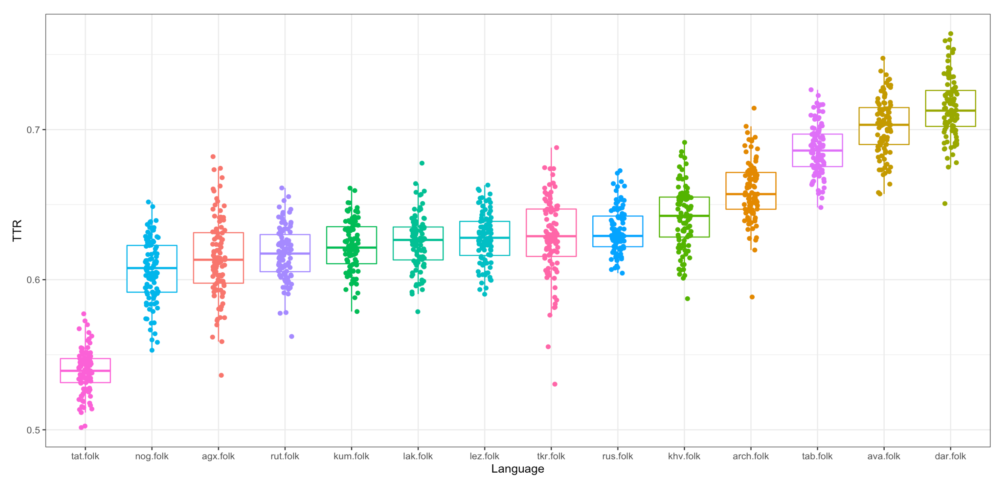
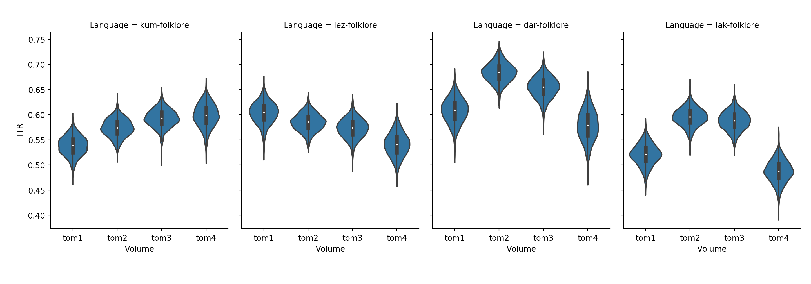
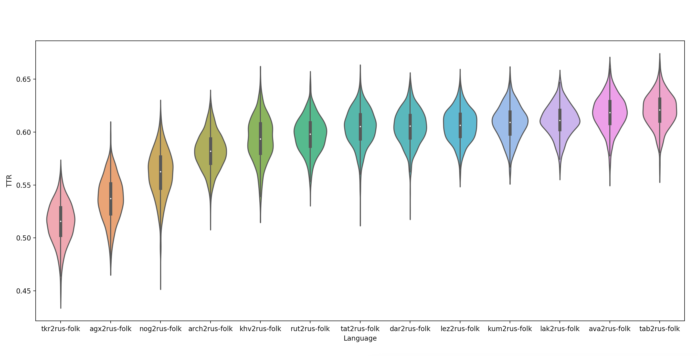
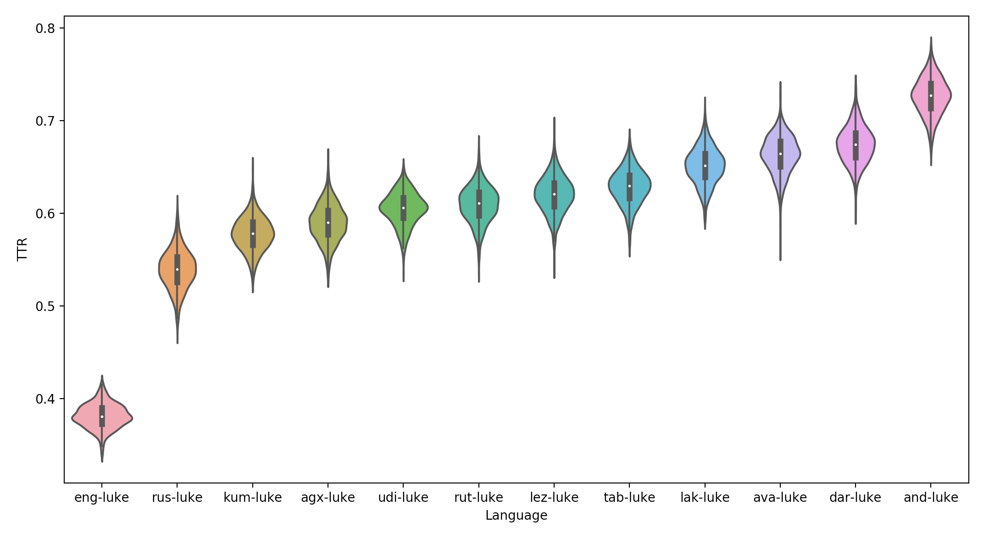

# Morphological complexity

The Heap's curve shows the dependence of the number of token types and the total number of tokens in a corpus. To draw the Heap's curve, we "read" the corpus from the beginning to the end and place new dots to the graph depending on whether each new token has already occured or not.

Figure 0. Heap's curves for corpora of different size.

We use the following formula to simulate the Heap's curve: . The main idea is that we first compile a frequency list and after that add tokens from this list to the graph according to their frequency.

Figure 1. Simulated Heap's curves for corpora of different size.

As can be seen from Figure 1, the Tokita curve started to coincide with the horisontal asymptote when it achieves 40,000 tokens (or even ealier). This is explained by the very small size of the Tokita corpus.

I manually cutted all the corpora (except Tokita), so that their size would be about 26,000 tokens.

Figure 2. Simulated Heap's curves for corpora of similar size.

Figures 3-4 show Zipf's curves (dependence of frequency of tokens from their rank) for corpora of different size and for corpora of similar size respectively.

Figure 3. Zipf's curves for corpora of different size.

Figure 3 (zoomed). Zipf's curves for corpora of different size.

Figure 4. Zipf's curves for corpora of similar size.

Figure 4 (zoomed). Zipf's curves for corpora of similar size.

## Bible texts

Gospel of Luke in four Daghestanian languages, Russian and English.

Figure 5. Zipf.

Figure 5. Zipf (zoomed).

Figure 6. (Real) Heap.

Figure 7. Simulated Heap.

## Sampling

Sampling of 100 sentences 1000 times (Bible texts).

Figure 8. Distribution of the number of token types in 100 sentences.

Figure 9. Distribution of TTR in 100 sentences.

Figure 10. Distribution of the number of token types in 100 sentences (y = probability density function).

Figure 11. Distribution of TTR in 100 sentences (y = probability density function).

Sampling of n sentences so that the total number of tokens would be about 1000 (Bible texts).  

Figure 12. Distribution of the number of token types in a sample of sentences.

Figure 13. Distribution of TTR in a sample of sentences.

Figure 14. Distribution of TTR in a sample of sentences (+ non-bible texts).

## Folklore texts

Figure 15. Distribution of TTR in samples of sentences from folklore texts.

The total number of tokens:

agx-folk.txt  4839
ava-folk.txt  35532
kum-folk.txt  44748
rut-folk.txt  18845
dar-folk.txt  31931
tab-folk.txt  23430
lak-folk.txt  30796
lez-folk.txt  39082
nog-folk.txt  4967
tkr-folk.txt  4495
tat-folk.txt  18742
rus-folk.txt  288801
arch-folk.txt  9094
khv-folk.txt  6704

Russian translations from SVOD are added as `rus-folk`.

Figure 16. Distribution of TTR in samples of sentences from folklore texts.

All previous plots were build based on 1000 TTRs per language. In Figures 17.1 and 17.2 there are only 100 TTRs per language.

Figure 17.1. Distribution of TTR in samples of sentences from folklore texts (100 TTRs / language).

Just a bit different visualization of the same data:

Figure 17.2. Distribution of TTR in samples of sentences from folklore texts (100 TTRs / language).

Comparison of TTR across volumes for languages with a large number of tokens:

Figure 18. TTR in folklore texts (1000 TTRs / language).

To check whether TTR in previous plots reflects the complexity of the language and not the texts, Russian translations of the texts in each of the languages are taken instead.

Figure 19. TTR in Russian translations of folklore texts (1000 TTRs / language).

Violinplots for bible texts (Gospel of Luke):

Figure 20. TTR in bible texts (1000 TTRs / language).

